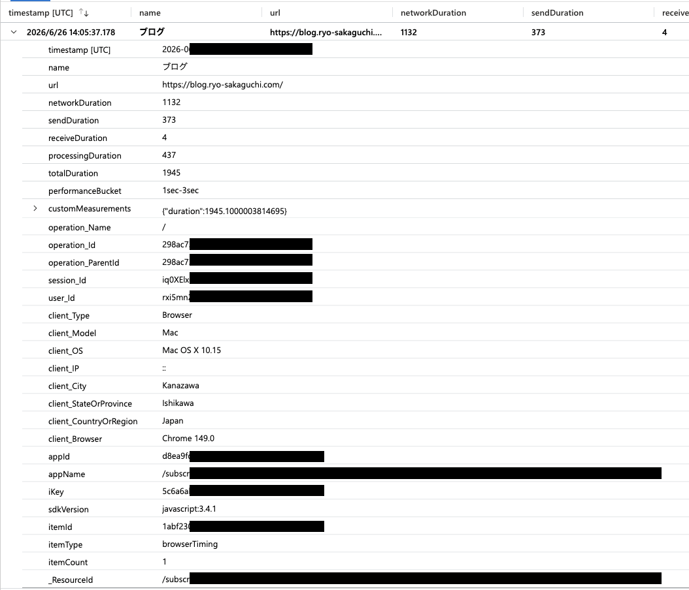
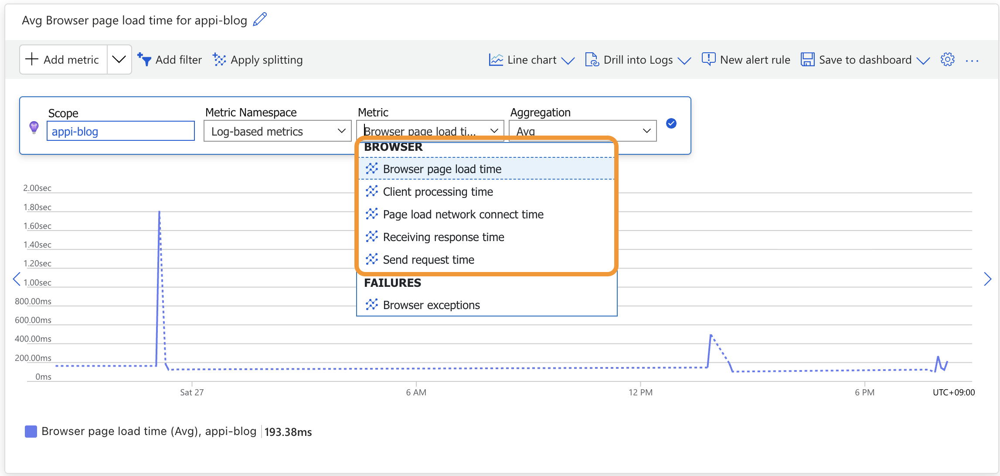
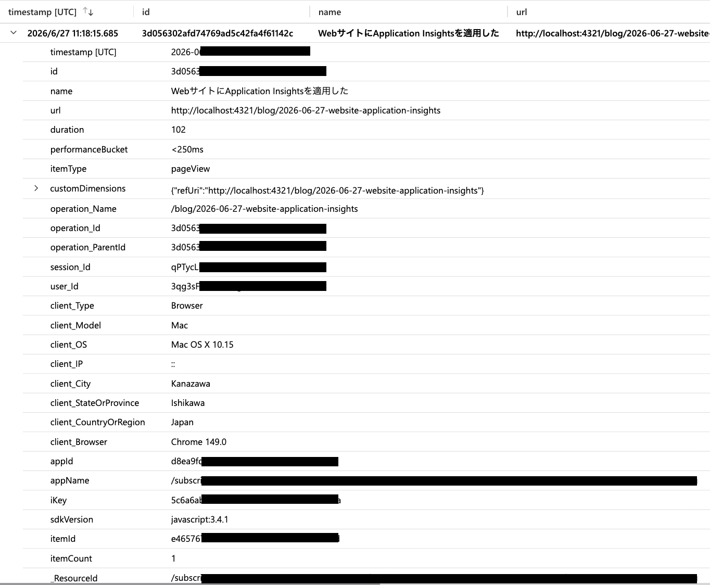
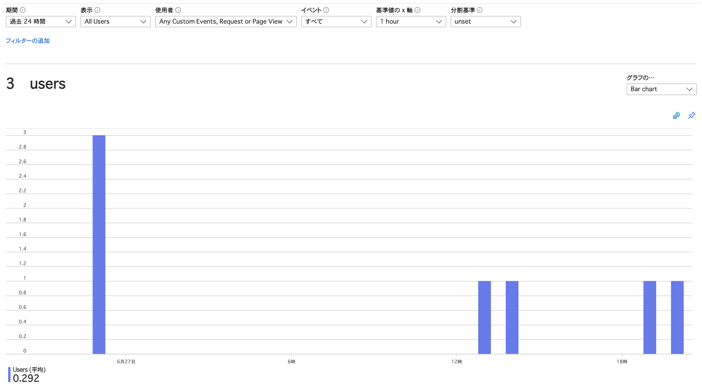
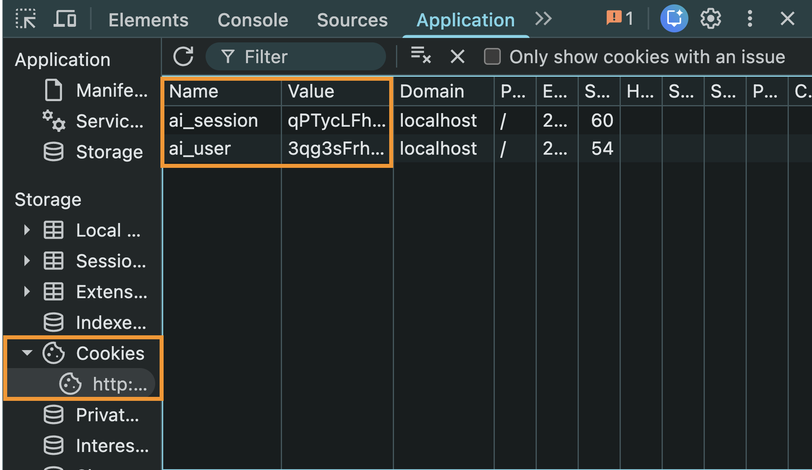
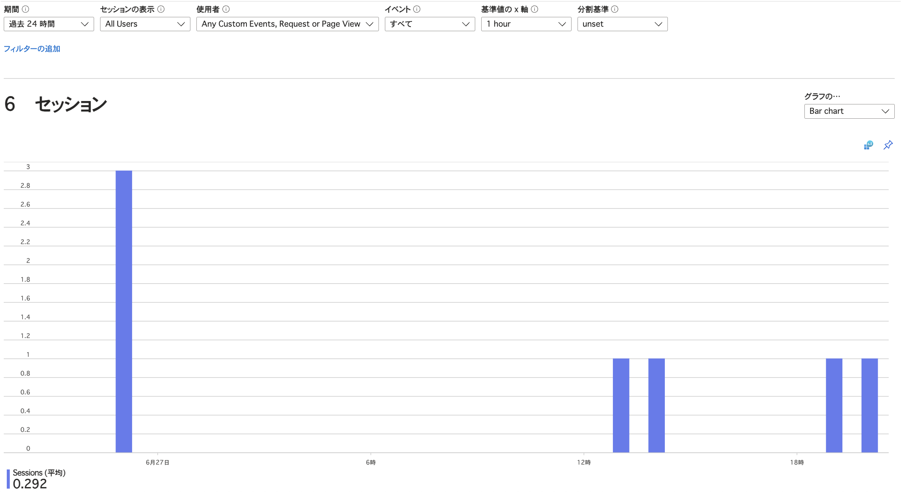
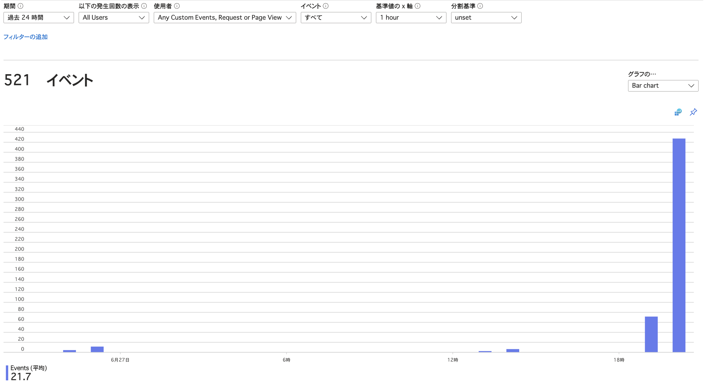
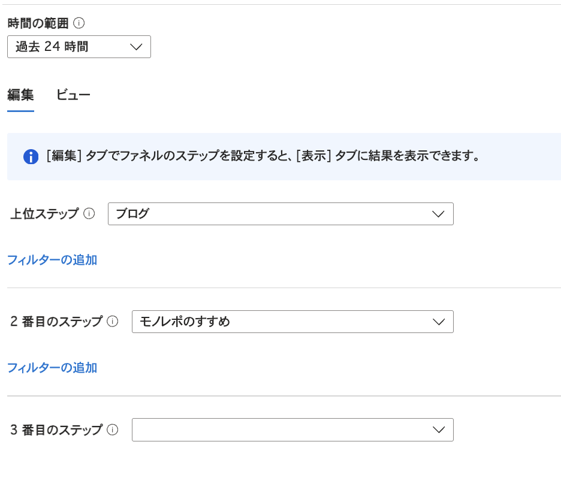
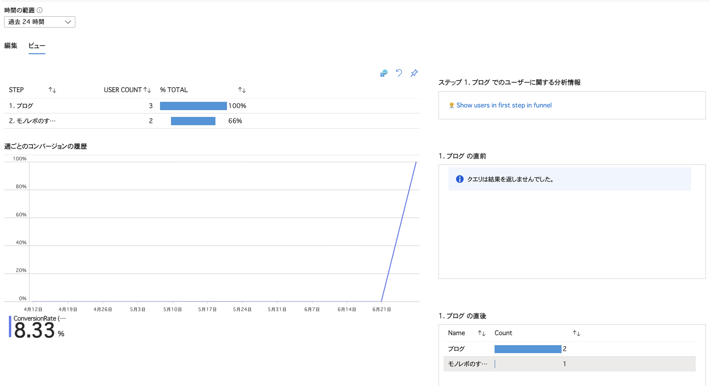
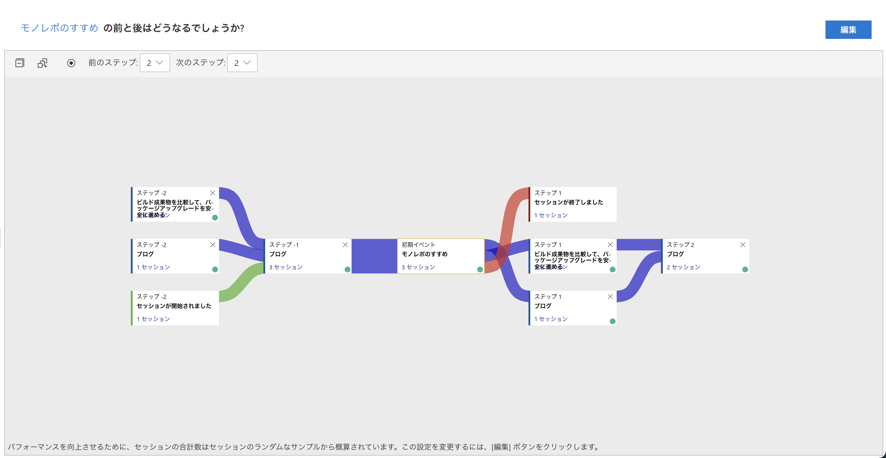

このブログにブラウザ側のApplication Insightsを導入した。

Application Insightsで`browserTimings`と`pageViews`というテーブルにデータが入るようになった。
また、これらのデータをもとに分析もできるようになった。

ここではそれぞれのテーブルの中身や、これらのデータでできる分析について見ていく。

## browserTimingsテーブル

Azure Portalの監視タブからログタブを選択すると、`browserTimings`テーブルや`pageViews`テーブルなどを閲覧できる。

`browserTimings`テーブルでは、ページが要求されてからロードされるまでの工程で、どこがボトルネックになっているかを調査できる。

注目すべき項目は以下:

* networkDuration: DNS解決、TCP/TLS接続など、ネットワーク接続が確立されるまでの時間
* sendDuration: リクエスト送信後、サーバー処理を経て、最初のレスポンスを受け取るまでの時間
* receiveDuration: 最初のレスポンスを受け取ってから、残りのレスポンス本文を受信し終えるまでの時間
* processingDuration: レスポンス本文を受信し終えてから、ブラウザー側でDOMの読み込みが完了するまでの時間
* totalDuration: 上記を合計した、ページ読み込み全体の時間

メトリクスタブからもこれらの指標を視覚的に閲覧できる。

## pageViewsテーブル

`pageViews`テーブルにはページが表示されるたびに新しいレコードが作られる。

SPA内でのページ遷移や、画面内のタブでの表示切り替えなどもページビューとして扱うことができる。

## ユーザー

使用状況タブからユーザータブをクリックすると、ユーザーの情報が見られる。

このブログには認証がないので、匿名ユーザーの情報が見られる。

匿名ユーザーIDは、異なるデバイス・ブラウザなどでサイトを開くと生成され、クッキーとして保存される。

## セッション

セッションタブからセッションを閲覧できる。セッションとは、ユーザーの活動を示したものだといえる。

同じサイトを表示し続けていても、30分以上動きがないと新しいセッションになる。また24時間以上使い続けていた場合も新しいセッションとなる。

セッションIDは匿名ユーザーIDと同様にクッキーとして管理されている。

## イベント

イベントタブから、ページビューやカスタムイベントなど、ユーザー行動に関するイベント統計を確認できる。

このブログではカスタムイベントを定義していないし、サーバーへのリクエストもしていないので、得られる洞察はページビューと変わらない。

## ファネル

ファネルタブでは、ユーザーが狙った通りの行動をどれくらい取ってくれたのか、つまりコンバージョン率が分かる。

最初にステップを定義する。例えばこのブログのトップページを開いたのち、「モノレポのすすめ」という記事を読むという行動パターンを設定する。

ページ遷移やカスタムイベントなどをステップとして定義できる。

ビューをクリックすると結果を見られる。トップページから「モノレポのすすめ」を読んだ人の割合は66%だということが分かる。

## ユーザーフロー

ユーザーフローでは、ユーザーの行動を可視化できる。

まずは起点を決める。起点はページビュー、カスタムイベント、例外などから選べる。

ここでは「モノレポのすすめ」というページビューを起点にする。すると、前後に起きたイベントが分かる。

# 参考

[Application Insights telemetry data model - Azure Monitor | Microsoft Learn](https://learn.microsoft.com/en-us/azure/azure-monitor/app/data-model-complete)

[Usage analysis with Application Insights - Azure Monitor | Microsoft Learn](https://learn.microsoft.com/en-us/azure/azure-monitor/app/usage?tabs=users)

[Supported metrics - microsoft.insights/components - Azure Monitor | Microsoft Learn](https://learn.microsoft.com/en-us/azure/azure-monitor/reference/supported-metrics/microsoft-insights-components-metrics#category-browser)

[Metrics in Application Insights - Azure Monitor - Azure Monitor | Azure Docs](https://docs.azure.cn/en-us/azure-monitor/app/metrics-overview?tabs=standard#browser-metrics)
