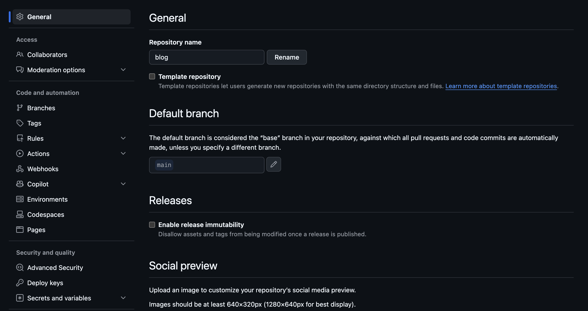

フロントエンド、バックエンド、インフラなど、色々とリポジトリを分けているプロジェクトは多くある。

リポジトリを分割する目的は一体なんだろうか。

もし何も思いつかない場合、すべてのリポジトリをマージし、1つのモノレポとして管理するのがおすすめだ。

複数リポジトリだと、何かと面倒なことが多いのだ。


## 複数リポジトリのデメリット

### 複数のリポジトリを管理するのが面倒

複数のリポジトリを管理するのは手間だ。

リポジトリごとに設定画面をいくつも注意深くレビューし、設定の誤りがないかを確認する必要がある。



モノレポならこれらが一箇所で済む。


### 複数のリポジトリを行き来するのが面倒

異なるリポジトリを行ったり来たりするのは面倒だ。

フロントエンドとバックエンドでリポジトリが分かれている場合、1つの機能を完成させるのに両方のリポジトリを行ったり来たりして作業する必要がある。

ちょっとした変更でもフロントエンドとバックエンドに分かれていたら2つのPRが必要になるし、GitHub上で複数リポジトリを見て回らないと一つの機能をレビューできない。

フロントエンドエンジニアが、バックエンドのAPI仕様や内部の動作を見たいときも、別リポジトリを開く必要がある。

バックエンドが自動生成したAPIクライアントをフロントエンドが使えるようにするために、何かしらの仕組みが必要となる。

モノレポならこれら全てを単純化できる。

1つの機能の変更に、1つのPRを作ればいい。調査が必要ならリポジトリ内を見てまわればいい。自動生成したバックエンドのAPIクライアントは、フロントエンドのディレクトリに出力すればいい。


### 互換性管理が面倒

リポジトリが分かれていると、どのフロントエンドのコミットと、どのバックエンドのコミットに互換性があるかが分からない。同じGitのタグを打つなどする必要がある。

リポジトリを分けてしまったがゆえ、あるリポジトリのコードをパッケージ化して社内レジストリに公開し、それを別リポジトリで消費するようなことをしている場合もある。こうすれば互換性を明示的に管理できる。が、パッケージにして公開してバージョンを管理するような営み自体が、やってみると結構な手間だ。

モノレポならこれらを単純化できる。というか、単に同じコミットのコードに互換性があるというだけだ。


### 依存の管理が面倒

例えばフロントエンドを複数のリポジトリに分割している場合、依存のアップグレードはリポジトリごとに行う必要がある。

フロントエンドのモノレポなら、依存のアップグレードは一箇所だけで済む。

例えばNode.jsのバージョン指定にはmiseの設定ファイルを一つ置けばいい。パッケージアップグレードにはpnpmのcatalog機能で一括管理できる。

バックエンドでもインフラでも同じような方法があり、依存管理の仕組みが単純化できる。


## モノレポで困らないこと

モノレポに漠然と不安を抱いている人もいるかと思う。その不安を解消したい。

### コードベースは散らかないしコンフリクトも多発しない

モノレポをしていても、コードベースは散らからないし、コンフリクトも多発しない。

以下のように機能ごとに適切にディレクトリを区切っていれば、複数リポジトリで作業するのと散らかり具合もコンフリクトの頻度も変わらないはずだ。

```
.
├── frontend/
│   └── packages/
│       ├── package-a
│       ├── package-b
│       └── package-c
├── backend/
│   └── modules/
│       ├── module-a
│       ├── module-b
│       └── module-c
├── infra/
│   └── environments/
│       ├── dev
│       ├── stg
│       └── prod
└── devops/
    ├── pr-template.md
    └── pipelines
```

もし散らかったりコンフリクトが多発するのであれば、たぶん複数リポジトリでも同じことが起きる。

散らからないようにコードベースを整理し、コンフリクトが起きないように小さいPRを頻繁にマージする習慣が必要だ。


### チームが大きくなってもPRレビューの画面が散らからない

GitHubにもAzure Reposにも、機械的に必須レビュワーを設定する機能があるはずだ。

必須レビュワーとしてアサインされたPRを見ればよい。


### Gitのパフォーマンスもそこまで悪くならない

私はまだモノレポでGitのパフォーマンスに悩んだことがない。

が、たしかにMicrosoftなど巨大IT企業が管理する巨大モノレポでは、Gitの操作がしんどく、独自のツールを開発しているという話を聞く。例えばMicrosoftの[Scalar](https://github.com/microsoft/git)がその一つだ。

ただ、Git操作をしんどく感じるほどコードベースが巨大になるには長い時間が必要だ。

実は独自ツールを使うまでもなく、これに対抗するGitコマンドはすでに用意されている。例えばパーシャルクローンやスパースチェックアウトが挙げられる。

パーシャルクローンはざっくりいうと、ファイルやディレクトリを部分的にクローンし、必要になったときに追加でフェッチしてくるような仕組みだ。

スパースチェックアウトは、ワーキングツリーに展開するファイルやディレクトリを一部に絞る仕組みだ。例えばルートディレクトリに`feature-a`, `feature-b`, `feature-c`などとディレクトリが並んでいる時、`feature-a`だけを手元に出して使うことができる。

このようなGitのコマンドを覚えてしまえば、多くの場合は困らないだろう。

もし大きなバイナリオブジェクトをそのままGitに置いている場合、Git LFSを使うとパフォーマンス向上につながる。


## もしモノレポを分割したくなったら

`git subtree`コマンドで、履歴を引き継ぎつつリポジトリを分割可能だ。

## もし複数リポジトリをモノレポにしたくなったら

`git subtree`コマンドで、履歴を引き継ぎつつリポジトリをマージ可能だ。


## 複数リポジトリが必要なのはどんなときか

複数リポジトリが必要なのは、チーム開発において、リポジトリの可視性の管理が必要になるときだ。
例えばあるメンバーにはあるリポジトリのコードを見せつつ、別のリポジトリのコードは見せられないなどといった事情があれば、モノレポは選べない。

また、コード行数単位で課金されるSaaSを利用している場合、リポジトリを分けて部分的に適用したいみたいなケースもあるのかもしれない。(SonarQubeなど)


## まとめ

まずはモノレポから始める。今理由なく複数リポジトリを使っている場合は`git subtree`でモノレポにする。

必要になったら`git subtree`で分割する。
